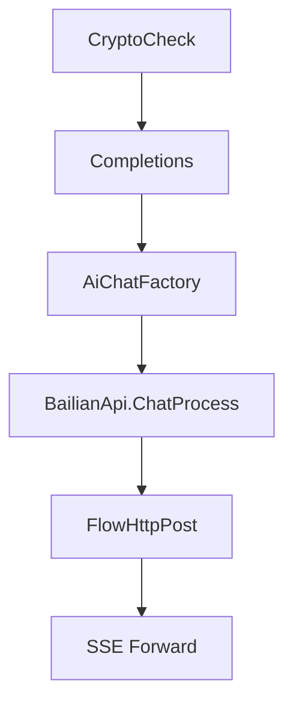
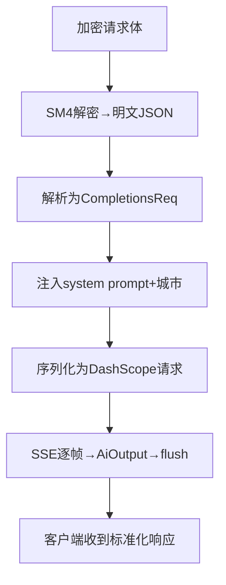

# Code Map — Supplement CLAUDE.md with Navigation Maps

Generate `CODEMAP.md` that helps Claude (and developers) quickly locate code for specific tasks and understand core business data flows. This is a **supplement to CLAUDE.md**, not a replacement — do not duplicate project overview, commands, or conventions that belong in CLAUDE.md.

## Design Principles

1. **Task-first navigation**: "To do X, edit these files" — developers (and AI) search by task, not by module
2. **Parallel call chains via Mermaid**: Text can't show parallel branches well — use Mermaid subgraphs to show concurrent flows
3. **Core modules, concise**: Each business module gets ≤ 3 lines: responsibility, key files, key functions
4. **CLAUDE.md aware**: Read CLAUDE.md first, skip what it already covers, only add new navigation-level content
5. **Line-number precise**: Task Index file paths include function line numbers for direct navigation

## Process

### Step 0: Check for CLAUDE.md

If `CLAUDE.md` exists in the project root, read it first. Note what sections it already covers (project overview, commands, conventions, tech stack). When generating CODEMAP.md, **do not repeat any of these**. Skip project overview, skip commands, skip development conventions. Focus entirely on navigation and data flow.

### Step 1: Discover

Find entry points, top-level structure, and identify the primary language/framework. Skip generated code (`.gen.go`, migrations, ORM output, etc.).

### Step 2: Layered Mode Decision

Count non-generated source files:

- **≤ 50 files**: Use **single-layer mode** — generate everything in one CODEMAP.md
- **> 50 files**: Use **two-layer mode** — generate a top-level CODEMAP.md with module table + task index + dependency graph, then create `CODEMAP-<module>.md` for each core business module's detailed call chains

Two-layer mode structure:
```
CODEMAP.md                    # Top-level: modules, task index, dependencies
CODEMAP-auth.md               # Detailed call chains for auth module
CODEMAP-billing.md            # Detailed call chains for billing module
CODEMAP-proxy.md              # Detailed call chains for proxy module
```

### Step 3: Identify Core Business Modules

Don't list every directory. Identify the **business modules** — groups of files that serve a specific domain purpose. For each:

- **Responsibility**: 1 line what it does
- **Key files**: 2-4 file paths (with line numbers for entry functions)
- **Key functions**: 2-3 function names that are the entry points

Example:
```
| 模块 | 职责 | 关键文件 | 入口函数 |
|------|------|---------|---------|
| AI 聊天 | 多模型路由 + SSE 转发 | `controller/aichat/default.go`, `service/aichatService/default.go:37`, `lib/utils/httputil/httputil.go:238` | `Completions()`, `AiChatFactory()`, `FlowHttpPost()` |
```

### Step 4: Build Task Index

For each major task a developer might want to do, list the files to edit **with line numbers**, **preconditions**, and **pitfalls**:

```markdown
## Task Index

### To add a new AI provider
1. `internal/service/aichatService/default.go:37` — add case to `AiChatFactory()`, implement `ChatStreamModel` interface
2. `lib/utils/httputil/httputil.go:238` — add case to `FlowHttpPost()` switch, write `*HandleStreamResponse()`
3. `internal/consts/aiModel.go:39` — add model constant to `ModelMapping`, update `IsBailianModel()` if needed

**Precondition**: Confirm upstream API is OpenAI-compatible. If not, need custom request/response structs.
**Pitfall**: `FlowHttpPost` has no default fallback — new cases must be explicitly listed, or they fall through to `BailianHandleStreamResponse`.
```

Build this by tracing: where does the factory/registry live? where does the handler live? where are the types defined? For each task, ask: what must be true before this works? what edge case has burned someone before?

### Step 5: Trace Call Chains — Control Flow + Data Flow

Split call chains into two distinct types:

**Control Flow** (谁调谁 — explicit function calls):


**Data Flow** (数据怎么变 — where data is transformed):


**Parallel branches** (async/goroutine): Use Mermaid subgraphs or suffix labels like `G1[UpdateChatLog async]`.

**Tracing rules**:
- **Only trace explicit calls**: function A calls function B, switch case dispatch, interface implementation. Do NOT trace implicit calls (ORM hooks, decorators, reflection, event bus subscribers, middleware auto-registration).
- **If you can't find an explicit call, don't guess**: Omit that link rather than infer it. Better a shorter accurate chain than a longer misleading one.
- **Note gaps**: If a known runtime behavior (e.g., middleware order, ORM query) has no explicit source-level call, add a "未追踪" note under the diagram.

Each diagram ≤ 12 nodes. Split at logical boundaries if needed.

**Confidence labels**: After EACH diagram, add a line with confidence level AND a verification hint if not high:
- `<!-- confidence: high — explicit static calls only -->`
- `<!-- confidence: medium — inferred from naming convention → verify: grep "Register" in router/ to confirm handler binding -->`
- `<!-- confidence: low — inferred from runtime behavior, not found in source → verify: check middleware registration order in main.go -->`

This tells future Claude instances not just which diagrams to trust, but **where to verify** before acting on them.

### Step 6: Generate the Document

Write to `CODEMAP.md` in the project root.

For **single-layer mode**:
```markdown
# [Project Name] — Code Map

Generated: [date]

## Core Business Modules

[Table: module | responsibility | key files | entry functions — ≤ 3 lines each, max 8 modules]

## Task Index

### [Task 1: e.g., "Add a new AI provider"]
[Numbered list of files to edit + what to change in each, with line numbers]

### [Task 2]
...

## Call Chains

### [Flow 1: e.g., "Chat request — control flow"]

```mermaid
flowchart TD
    [explicit function calls, ≤ 12 nodes]
```

<!-- confidence: high — explicit static calls only -->
<!-- blind spots: [what this chain doesn't cover — e.g., no retry mechanism, upstream timeout returns 502 directly, no integration test for this path] -->

### [Flow 2: e.g., "Chat request — data flow"]

```mermaid
flowchart TD
    [data transformations at each step, ≤ 12 nodes]
```

<!-- confidence: medium — inferred from naming convention → verify: grep "Register" in router/ -->
<!-- blind spots: [e.g., middleware execution order not traced, Flume async reporting lifecycle unknown] -->

### [Flow 3: e.g., "Model routing decision tree"]

```mermaid
flowchart TD
    [decision tree with branching, ≤ 12 nodes]
```

<!-- confidence: high — explicit switch case -->

## Module Dependencies

```mermaid
flowchart TD
    [compact dependency graph — ≤ 12 nodes, split into subgraphs if needed]
```

[Brief: which modules are hubs, which are leaves, any notable circular dependencies]

## Change Log

Append one entry per skill run. This tracks **business logic changes observed in the source code**, NOT the skill's analysis actions. Each entry records what the codebase *does differently* compared to the last run.

Format:
```
| Date | Business Area | Change |
|------|---------------|--------|
| 2026-05-13 | Initial | CODEMAP created — AI chat routing (12 providers), billing (pre-consume + post-consume), agent system |
| 2026-05-20 | AI 聊天 | CompletionsV2 新增 IntentType=7 路由到语音模型，Skill 路由表新增 3 个语音类 skill |
| 2026-06-01 | 计费 | PostConsume 新增企业成员共享池扣减逻辑，PreConsume 增加 owner 钱包双校验 |
```

**Rules:**
- **Business Area**: High-level area (AI 聊天, 计费, 渠道, 代理商, 企业后台, etc.)
- **Change**: What business logic changed — e.g., "新增语音模型路由", "计费增加 owner 钱包校验", "渠道选择新增 protocol 匹配"
- Do NOT write "traced X function" or "analyzed Y file" — those are analysis actions, not business changes
- Keep the most recent 5 entries. When trimming, drop oldest first.

## Last Updated

- **Generated**: [date]
- **Codebase state**: [brief description]
- **Known gaps**: [what wasn't covered]
- **Update checklist**: [items to check next time the skill runs]
```

For **two-layer mode**, the top-level `CODEMAP.md` omits call chains (replaced by links to per-module files), and each `CODEMAP-<module>.md` contains only that module's detailed diagrams.

## Managing CODEMAP Growth

CODEMAP.md grows over time as the project evolves. To prevent context bloat:

**Change Log with delta comparison**: When CODEMAP.md already exists, read the last Change Log entry before analyzing. Compare the current codebase against what was recorded last time. Append one row that captures the **difference** — new functions, new routes, modified business rules, removed features. If nothing changed in a business area, do not write an entry for it. Only record actual deltas, not re-tracing the same code.

Example of good delta entries:
- "AiChatFactory 新增 `OpenRouter` case，对应 handler 在 `httputil.go:310`"
- "billing_service.go:552 PostConsume 新增企业成员共享池扣减分支"
- "CompletionsV2 IntentType 路由新增 case 7 → 语音模型"

Example of bad entries:
- "分析了 AiChatFactory 函数"（这是动作，不是变化）
- "CODEMAP 更新了"（这是空话，没说变了什么）

**Section-aware threshold**: When CODEMAP.md exceeds 200 lines:
1. **Change Log**: Trim to the most recent 5 entries. Older business changes belong in the Last Updated summary, not the log table.
2. **Call Chains**: If a single flow diagram exceeds 15 nodes, split it into two diagrams (sync vs async). If a module has > 3 diagrams in total, move that module to a separate `CODEMAP-<module>.md` file and replace with a link.
3. **Core Business Modules**: Never trim this table — it's the primary navigation anchor. If > 10 modules, split rarely-used ones into a "扩展模块" subsection.
4. **Task Index**: Keep all entries. If an entry references a deleted file, remove it.
5. **Module Dependencies**: Keep one diagram. Never duplicate.

**When to rewrite from scratch**: If CODEMAP.md exceeds 300 lines after trimming, rewrite the entire file. Do not try to preserve sections — a full re-scan is more reliable than incremental patching at this size.

**Auto-trigger**: The skill should check line count on every run and apply trimming before writing.

## Tips

- **Never repeat CLAUDE.md**: If CLAUDE.md already covers the project overview, skip it. Focus on navigation and data flow.
- **Diagrams should be small**: ≤ 12 nodes per Mermaid diagram. Split into multiple diagrams if needed.
- **Task index is the most important section**: Developers search by task first. Make it precise with file paths, function names, and line numbers.
- **Skip generated code**: Don't trace into `.gen.go`, migrations, ORM output, etc.
- **Use real file paths with line numbers**: Not "module/controller" — `controller/aichat/default.go:201`.
- **Only trace explicit calls**: Function A calls function B, switch case, interface impl. Do NOT trace decorators, reflection, event bus, middleware auto-registration, ORM hooks. If you can't find it in source, omit it.
- **Add confidence + verify**: Every diagram gets confidence (high/medium/low). If not high, add a `→ verify:` hint telling Claude where to check before acting.
- **Task Index needs preconditions + pitfalls**: List what must be true before the task works, and what edge case has burned someone. This is the difference between "edit these files" and "edit these files, and don't forget X".
- **Add blind spots**: After each Call Chain diagram, add a `blind spots` note listing what the chain does NOT cover — no retry, no test, upstream timeout behavior, etc. Knowing what's missing is as important as knowing what's there.
- **Split by flow type**: Control flow (who calls who) and data flow (how data transforms) get separate diagrams. Parallel/async branches get their own diagram or use subgraph grouping.
